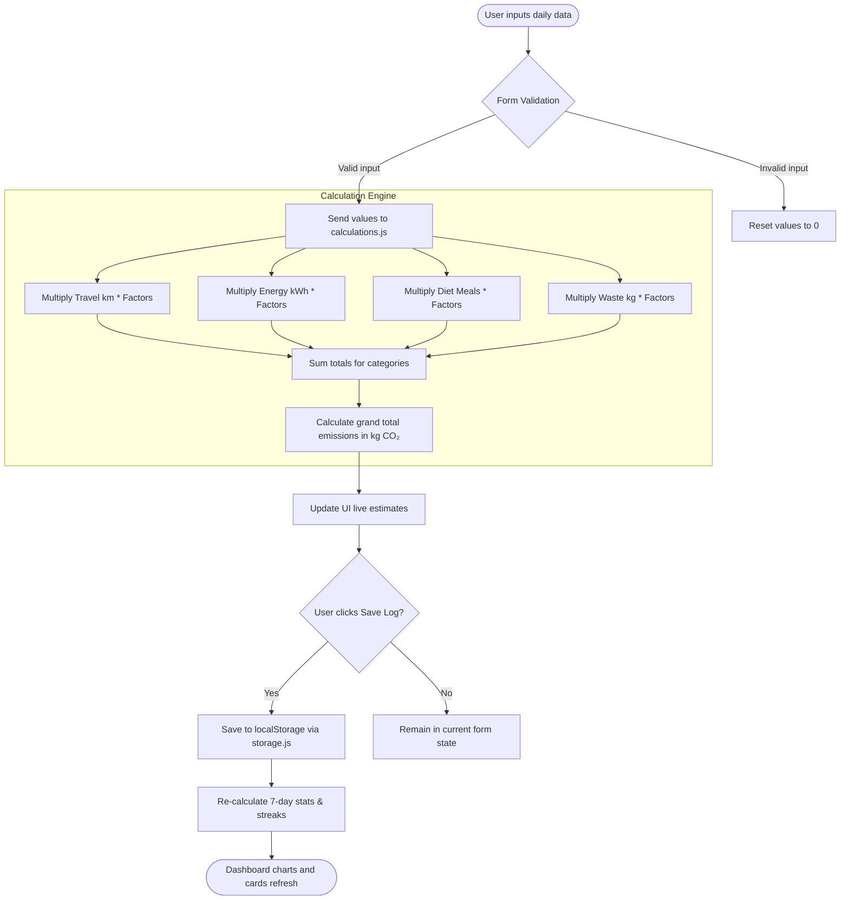
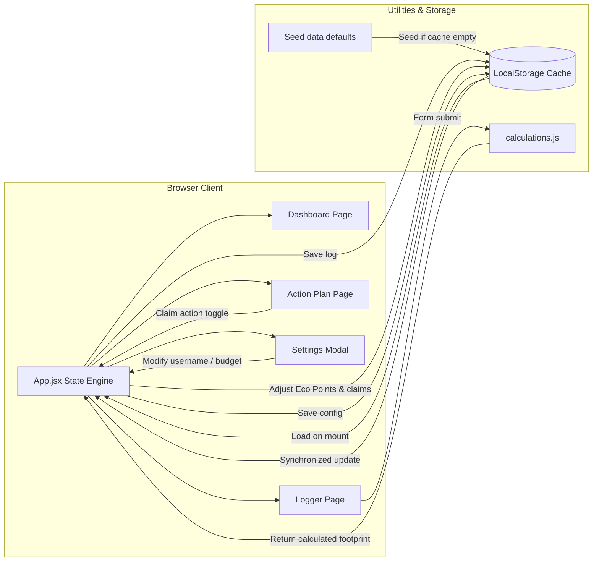

# 🌱 EcoTrack | Carbon Footprint Tracker

**EcoTrack** is a production-ready, highly interactive Carbon Footprint Awareness and Analytics platform built with **React (Vite)**, **Tailwind CSS**, and **Recharts**. The app helps users log their daily activities, view real-time carbon emissions breakdowns, simulate offset equivalents, and commit to eco-friendly habits.

---

## 🚀 Key Features

*   📊 **Comprehensive Dashboard**: Real-time stats showing daily scores, 7-day average outputs, streak counters, and target comparison highlights.
*   🍰 **Category Split (Pie Chart)**: Clear Recharts breakdown showing the proportion of transit, electricity, diet, and waste impact.
*   📈 **Emissions Trend (Line/Area Chart)**: 7-day chronological emission charts plotted against an adjustable daily carbon target.
*   📝 **Interactive Activity Logger**: Tabbed input forms (Travel, Energy, Diet, Waste) utilizing range sliders, quick-seed profiles, and a live calculator.
*   🔄 **Environmental Offset Simulator**: Slider-controlled tool converting CO₂ weights into tangible visual equivalents (e.g. tree days, car kms avoided, phone charges).
*   💡 **Gamified Eco-Challenges**: Action Plan listing tailored habits (easy, medium, hard) to claim, earning Eco Points and building user profile tiers.
*   💾 **Persistent Data Engine**: Complete localStorage integration ensures logs, configurations, and completed actions remain stored across sessions.

---

## 📂 Project Structure

```
e:/prowarcha3/
├── tailwind.config.js       # Tailwind CSS v3 customizations
├── postcss.config.js        # PostCSS directives
├── package.json             # NPM dependencies (recharts, lucide-react, etc.)
├── index.html               # Main entry HTML, dynamic viewport & Google Fonts
├── src/
│   ├── main.jsx             # React Virtual DOM mounting
│   ├── App.jsx              # Routing, State Engine, and Settings Portal
│   ├── index.css            # Tailwind layers & custom glassmorphism styles
│   ├── App.css              # Cleared template style configurations
│   ├── data/
│   │   ├── emissionFactors.js   # Constants representing kg CO₂ conversion rates
│   │   ├── initialLogs.js       # Dynamic 7-day mock seed database
│   │   └── suggestionsData.js   # Action list database with reward settings
│   ├── components/
│   │   ├── Navbar.jsx           # Responsive sidebar/header with score badges
│   │   ├── StatCard.jsx         # Color-coded stat block with trend tags
│   │   └── OffsetSimulator.jsx  # Interactive equivalent-saving simulator
│   ├── pages/
│   │   ├── Dashboard.jsx        # Landing dashboard compiling stats and Recharts graphs
│   │   ├── InputForm.jsx        # Logging form with preset configurations
│   │   ├── Analytics.jsx        # Comparative benchmark analytics and historical log list
│   │   └── Suggestions.jsx      # Categorized filters list for claimable challenges
│   └── utils/
│       ├── calculations.js      # Carbon addition algorithms
│       └── storage.js           # CRUD interface for localStorage synchronization
```

---

## 🧪 Carbon Footprint Calculation Formula

Emissions are calculated in **Kilograms of CO₂ Equivalent (kg CO₂e)** using multipliers based on typical EPA & DEFRA standards:

$$\text{Total Daily Emissions} = \text{Travel} + \text{Energy} + \text{Diet} + \text{Waste}$$

### Coefficients Used

| Category | Sub-type | Unit | Coefficient (kg CO₂ / unit) |
| :--- | :--- | :--- | :--- |
| **Travel** | Petrol Car | km | `0.18` |
| | Diesel Car | km | `0.17` |
| | Hybrid Car | km | `0.11` |
| | Electric Car | km | `0.05` |
| | Motorcycle | km | `0.10` |
| | Bus | km | `0.08` |
| | Train | km | `0.04` |
| | Flight | km | `0.25` |
| **Energy** | Grid Electricity | kWh | `0.38` |
| | Renewable Solar | kWh | `0.02` |
| **Diet** | Vegan Meal | meal | `0.35` |
| | Vegetarian Meal | meal | `0.60` |
| | Light Meat / Fish | meal | `1.40` |
| | Heavy Meat (Beef/Pork) | meal | `2.80` |
| **Waste** | Landfill Trash | kg | `0.50` |
| | Recycled Waste | kg | `0.10` |

---

## 🗺️ System Flowcharts

### 1. User Input & Emission Calculation Flow
The diagram below illustrates the steps taken when a user enters activity values on the logging page:



### 2. State & Data Persistence Flow
The architectural model below depicts how global states are synced between user actions, standard configs, and local storage:



---

## 🛠️ Installation & Setup

### Prerequisites
Make sure you have Node.js (`v20+` recommended) and npm installed on your system.

### Steps
1.  **Clone / Copy directory**:
    Ensure you are in the workspace root directory.
2.  **Install dependencies**:
    ```bash
    npm install
    ```
3.  **Run Development Server**:
    ```bash
    npm run dev
    ```
    Open `http://localhost:5173/` in your web browser.
4.  **Create Production Build**:
    ```bash
    npm run build
    ```

---

## 🧑‍💻 Technologies & Packages Used
*   **Vite & React JS** - For rapid bundling and components rendering.
*   **Tailwind CSS** - Modern custom styles and dark-theme panels.
*   **Recharts** - Responsive, performant SVGs representing Area trends and Pie distributions.
*   **Lucide React** - High-quality, clean vector iconography.
*   **LocalStorage API** - Synchronous client-side persistence.
